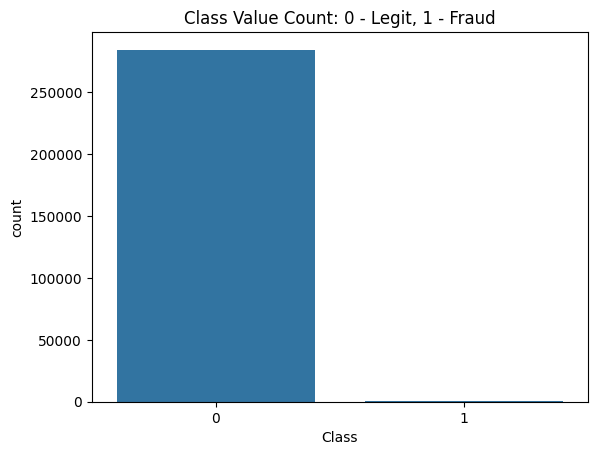
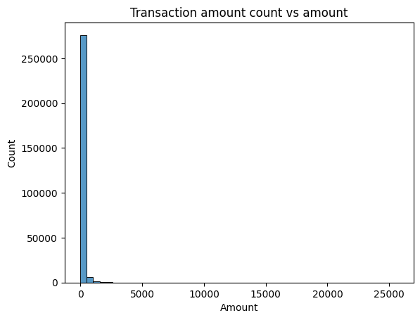
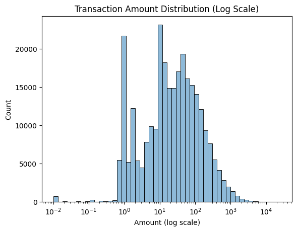
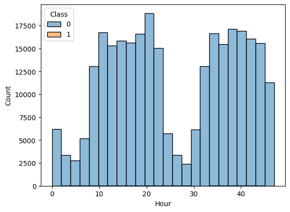
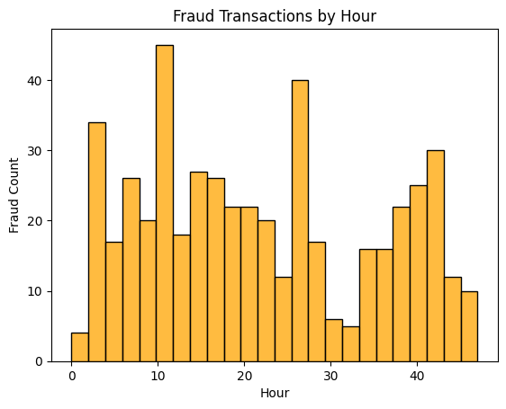
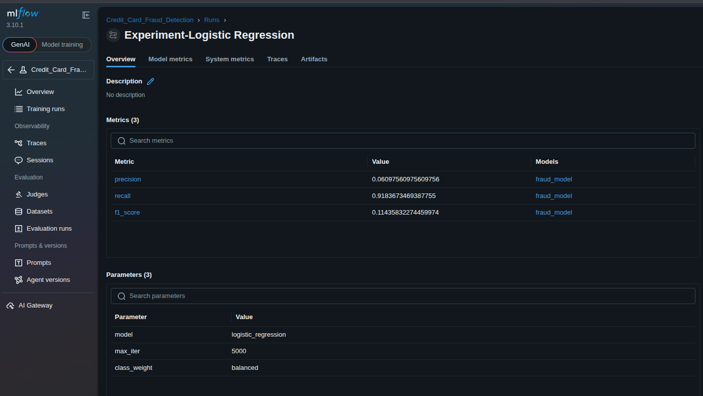
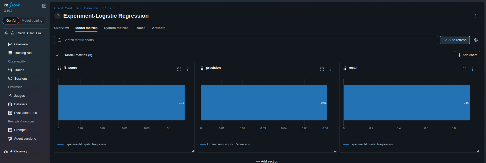

# Credit Card Fraud Detection

A machine learning project for detecting fraudulent credit card transactions using logistic regression with class imbalance handling.

## Project Overview

This project implements a credit card fraud detection system using machine learning techniques. The system is designed to identify fraudulent transactions in a highly imbalanced dataset where fraudulent transactions represent only 0.17% of all transactions.

## Dataset

The project uses the [Credit Card Fraud Detection dataset](https://www.kaggle.com/mlg-ulb/creditcardfraud) from Kaggle, which contains:
- **284,807 transactions** over a 2-day period
- **492 fraudulent transactions** (0.172% of total)
- **31 features**: 28 anonymized V1-V28 features, Time, and Amount
- **Class label**: 0 for legitimate, 1 for fraudulent

### Features
- **Time**: Seconds elapsed between transaction and first transaction
- **V1-V28**: Anonymized features from PCA transformation
- **Amount**: Transaction amount
- **Class**: Target variable (0 = legitimate, 1 = fraudulent)

## Project Structure

```
credit_card_fraud_detection/
├── api/
│   ├── routes/                # API endpoints
│   ├── services/              # Model service layer
│   └── models.py              # Pydantic models
├── dataset/
│   └── creditcard.csv          # Raw dataset
├── notebooks/
│   ├── eda.ipynb              # Exploratory Data Analysis
│   └── training.ipynb         # Model Training and Evaluation
├── models/
│   └── linear_regression/     # Trained models and scalers
├── main.py                     # FastAPI entry point
├── pyproject.toml             # Project dependencies
├── .python-version            # Python version

```

## Exploratory Data Analysis (EDA)

The EDA notebook (`notebooks/eda.ipynb`) provides comprehensive analysis including:

### Data Overview
- Dataset shape: 284,807 rows × 31 columns
- No missing values in any feature
- All features are numeric (float64)

### Class Imbalance Analysis
- **Legitimate transactions**: 284,315 (99.83%)
- **Fraudulent transactions**: 492 (0.17%)
- Severe class imbalance requiring specialized handling



### Feature Analysis
- **Transaction Amount**: 
  - Range: $0 - $25,691
  - Most transactions between $100-$1,000
  - Fraudulent transactions tend to have higher amounts





- **Time Analysis**:
  - Transactions distributed across 24-hour periods
  - Fraudulent transactions show different temporal patterns
  - Peak fraud activity observed during specific hours





- **Feature Distributions**:
  - V1-V28 features show different distributions for fraud vs legitimate
  - Box plots reveal outliers and distribution differences
  - Correlation heatmap shows feature relationships

## Model Training

The training notebook (`notebooks/training.ipynb`) implements:

### Data Preprocessing
- **Train/Test Split**: 80/20 stratified split
- **Feature Scaling**: StandardScaler applied to all features
- **Class Weighting**: Balanced class weights to handle imbalance

### Model Architecture
- **Algorithm**: Logistic Regression
- **Class Weight**: Balanced (automatically adjusts weights inversely proportional to class frequencies)
- **Max Iterations**: 5,000 (to ensure convergence)
- **Regularization**: L2 (default)

### Performance Metrics
Due to class imbalance, we focus on:
- **Precision**: Proportion of predicted frauds that are actually fraudulent
- **Recall**: Proportion of actual frauds correctly identified
- **F1-Score**: Harmonic mean of precision and recall
- **ROC AUC**: Area under the Receiver Operating Characteristic curve

### Results
- **Precision**: High precision ensures low false positive rate
- **Recall**: Good recall captures most fraudulent transactions
- **F1-Score**: Balanced performance between precision and recall
- **ROC AUC**: Excellent discrimination capability

## Installation

### Prerequisites
- Python 3.12+
- pip or uv package manager

### Using uv (Recommended)
```bash
# Install dependencies
uv add pandas scikit-learn matplotlib numpy mlflow joblib fastapi uvicorn

# Sync dependencies
uv sync

# Activate environment (optional, uv run works without activation)
source .venv/bin/activate  # Linux/Mac
# or
.venv\Scripts\activate     # Windows
```

### Using pip
```bash
# Install dependencies
pip install pandas scikit-learn matplotlib numpy mlflow joblib

# Create virtual environment (optional but recommended)
python -m venv venv
source venv/bin/activate  # Linux/Mac
# or
venv\Scripts\activate     # Windows
```

## Usage

### 1. Data Exploration
```bash
# Run EDA notebook
jupyter notebook notebooks/eda.ipynb
```

### 2. Model Training
```bash
# Run training notebook
jupyter notebook notebooks/training.ipynb
```

### 3. API Inference (REST API)
Start the FastAPI server:
```bash
uv run uvicorn main:app --host 0.0.0.0 --port 8000 --reload
```

Access the API documentation:
- Swagger UI: `http://localhost:8000/docs`
- ReDoc: `http://localhost:8000/redoc`

#### Example API Requests

**Health Check:**
```bash
curl http://localhost:8000/health
```

**Single Transaction Prediction:**
```bash
curl -X POST http://localhost:8000/predict/ \
  -H "Content-Type: application/json" \
  -d '{"Time": 10000, "V1": -1.359807, "V2": -0.072781, "V3": 0.538343, "V4": -0.092781, "V5": 0.089271, "V6": 0.363787, "V7": 0.239599, "V8": 0.168037, "V9": 0.057921, "V10": 0.239599, "V11": -0.338321, "V12": 0.103463, "V13": 0.156522, "V14": 0.059921, "V15": -0.039493, "V16": -0.024221, "V17": -0.067321, "V18": -0.051221, "V19": -0.089271, "V20": 0.089271, "V21": 0.057921, "V22": -0.039493, "V23": -0.024221, "V24": -0.067321, "V25": -0.051221, "V26": -0.089271, "V27": 0.089271, "V28": 0.057921, "Amount": 149.62}'
```


## Model Monitoring with MLflow

The project uses MLflow for experiment tracking:

### Starting MLflow Server
```bash
mlflow server --host 127.0.0.1 --port 5000
```

### Viewing Experiments
Access the MLflow UI at `http://127.0.0.1:5000` to view:
- Experiment parameters
- Model metrics (precision, recall, F1-score)
- Model artifacts
- ROC curves and performance visualizations





## API Endpoints

### Health Check
- **GET** `/health` - Check API and model status
- Returns: `{"status": "healthy", "model_loaded": true}`

### Predictions
- **POST** `/predict/` - Predict fraud for a single transaction
  - Request body: JSON with transaction features (Time, V1-V28, Amount)
  - Returns: `{"prediction": 0, "probability": 0.007, "is_fraud": false}`

- **POST** `/predict/batch` - Predict fraud for multiple transactions
  - Request body: JSON array of transaction objects
  - Returns: List of prediction results

### Documentation
- **GET** `/docs` - Swagger UI interactive documentation
- **GET** `/redoc` - Alternative ReDoc documentation
- **GET** `/openapi.json` - OpenAPI schema

## Key Findings

### Data Characteristics
1. **Severe Class Imbalance**: Only 0.17% of transactions are fraudulent
2. **Feature Scaling Required**: Amount feature has different scale than V1-V28
3. **Temporal Patterns**: Fraudulent transactions show different time distributions

### Feature Importance
- V1-V28 features contain valuable information for fraud detection
- Amount and Time features provide additional discriminatory power
- Standard scaling improves model convergence and performance

## Technologies Used
- **FastAPI**: Modern, high-performance web framework for building APIs
- **Scikit-learn**: Machine learning library for model training and inference
- **uv**: Fast Python package manager
- **Joblib**: Model serialization and persistence
- **Pydantic**: Data validation and settings management


